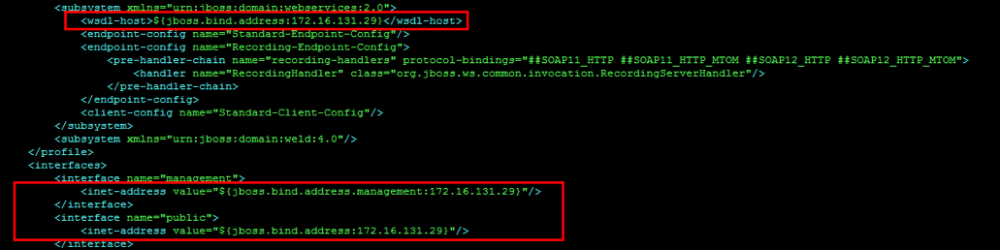

# Valle-WildFly-JBoss

## Instalación

Lo primero que debemos hacer es instalar el cliente JDK y actualizar todo el servidor:
```console
apt-get install default-jdk -y
apt-get install software-properties-common
apt update -y && sudo apt upgrade -y
add-apt-repository ppa:linuxuprising/java
apt-get update
java -version
```

Luego ubicamos el directorio /opt y nos descargamos Wildfly desde la propia web de JBOSS.

```console
cd /opt/
wget https://download.jboss.org/wildfly/15.0.1.Final/wildfly-15.0.1.Final.tar.gz
tar -xvzf wildfly-15.0.1.Final.tar.gz
```

Editamos el fichero para cambiar los datos de conexión, ya que por defecto los datos de conexión apuntan a la IP 127.0.0.1.

```code
vim /opt/wildfly-15.0.1.Final/standalone/configuration/standalone.xml
```

Cambiamos la IP 127.0.0.1 por la IP que toque para nuestro servidor.



## Añadir usuarios

Usaremos el siguiente comando para añadir un usuario administrador.
Este ejecutará un script que nos hará preguntas sobre los datos del usuario.

```console
./opt/wildfly-15.0.1.Final/bin/add-user.sh
```

Respondemos a las preguntas de la forma siguiente:

``` console
What type of user do you wish to add?
a) Management User (mgmt-users.properties)
b) Application User (application-users.properties)
(a):a

Enter the details of the new user to add.
Using realm ‘ManagementRealm’ as discovered from the existing property files.
Username : wildflyadmin
Password recommendations are listed below. To modify these restrictions edit the add-user.properties configuration file.
– The password should be different from the username
– The password should not be one of the following restricted values {root, admin, administrator}
– The password should contain at least 8 characters, 1 alphabetic character(s), 1 digit(s), 1 non-alphanumeric symbol(s)
Password : **********
Re-enter Password : **********
What groups do you want this user to belong to? (Please enter a comma separated list, or leave blank for none)[ ]: wildfly
About to add user ‘wildflyadmin’ for realm ‘ManagementRealm’
Is this correct yes/no? yes
Added user ‘wildflyadmin’ to file ‘/opt/wildfly/standalone/configuration/mgmt-users.properties’
Added user ‘wildflyadmin’ to file ‘/opt/wildfly/domain/configuration/mgmt-users.properties’
Added user ‘wildflyadmin’ with groups wildfly to file ‘/opt/wildfly/standalone/configuration/mgmt-groups.properties’
Added user ‘wildflyadmin’ with groups wildfly to file ‘/opt/wildfly/domain/configuration/mgmt-groups.properties’
Is this new user going to be used for one AS process to connect to another AS process?
e.g. for a slave host controller connecting to the master or for a Remoting connection for server to server EJB calls.
yes/no? yes
To represent the user add the following to the server-identities definition <secret value=»xxxxx» />

```

Ahora ya podemos arrancar el servicio del WildFly con el siguiente script:

```console
./wildfly-15.0.1.Final/bin/standalone.sh
```