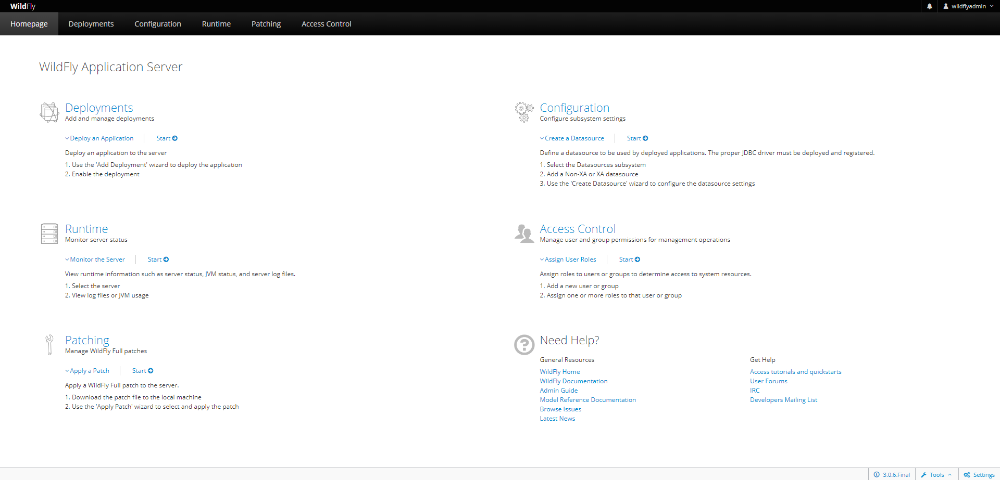

## Hacer un deploy

### Paso 1

Descargar un archivo war de esta url:
https://github.com/AKSarav/SampleWebApp/raw/master/dist/SampleWebApp.war

### Paso 2
Acceder a la consola

Acceder a la pestaña de deployments

Le damos a Upload Deployment y ponemos el archivo

Abrimos la aplicación

Accedemos a la aplicacion haciendo click en SampleWebApp

